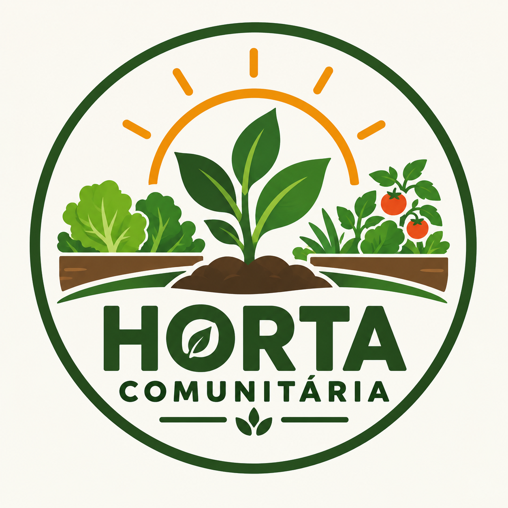

# Horta Comunitária



Sistema de gestão para hortas comunitárias urbanas: participantes, canteiros,
culturas, plantios, atividades de manejo, colheitas e destinação do que é
colhido, com um painel de indicadores gerais.

Projeto da **AEP (Atividade de Estudo Programada) — 4º Semestre 2026.2**,
Engenharia de Software / Análise e Desenvolvimento de Sistemas — UniCesumar.

**Equipe:** Jean Novaes, Gabriel Kondo, Lucas Reche

## Alinhamento aos ODS

- **ODS 2 — Fome Zero**: rastreio de destinações (doação, cozinha
  comunitária, banco de alimentos) do que é colhido.
- **ODS 11 — Cidades e Comunidades Sustentáveis**: gestão coletiva de
  hortas urbanas em múltiplos canteiros e voluntários.
- **ODS 12 — Consumo e Produção Responsáveis**: regra de negócio que impede
  destinar mais do que foi efetivamente colhido.

O detalhamento da Descoberta e da Concepção está em
[`docs/entrega-1.md`](docs/entrega-1.md).

## Lista de Requisitos

1. O sistema deve permitir o cadastro de participantes, com nome completo,
   contato (e-mail ou telefone) e tipo de participação (Administrador,
   Responsável ou Voluntário).
2. O sistema deve permitir o cadastro de canteiros, com identificação única,
   localização, tamanho em m² e status (Ativo, Em preparo, Em colheita ou
   Inativo).
3. O sistema deve permitir o cadastro de culturas (espécies cultivadas), com
   nome, categoria e período estimado de cultivo em dias.
4. O sistema deve permitir registrar plantios, associando uma cultura a um
   canteiro, com data do plantio, quantidade de mudas/sementes e observação.
5. O sistema deve permitir registrar atividades de manejo (rega, adubação,
   capina, poda, controle de pragas, preparo de solo) associadas a um
   canteiro e a um participante responsável, com data e descrição.
6. O sistema deve permitir registrar colheitas a partir de um plantio, com
   data e quantidade colhida em kg.
7. O sistema deve permitir registrar destinações de uma colheita (doação,
   cozinha comunitária, banco de alimentos, consumo dos participantes ou
   venda solidária), impedindo que a soma das destinações de uma colheita
   ultrapasse a quantidade colhida.
8. O sistema deve apresentar um painel com indicadores gerais: total de
   participantes, canteiros ativos, total colhido (kg) e total destinado
   (kg).

## Cronograma de Execução

| Data               | Atividade                                                                             | Responsável   |
| ------------------ | ------------------------------------------------------------------------------------- | ------------- |
| 08/09 – 12/09/2026 | Descoberta: levantamento de dores, partes interessadas e requisitos                   | Jean Novaes   |
| 13/09 – 17/09/2026 | Modelagem do banco de dados (DER) e `database/schema.sql`                             | Gabriel Kondo |
| 18/09 – 21/09/2026 | Diagrama de classes e definição da arquitetura                                        | Lucas Reche   |
| 22/09 – 25/09/2026 | Estruturação do repositório (`/src`, `/docs`, `/database`) e ambiente (Neon Postgres) | Jean Novaes   |
| 26/09 – 28/09/2026 | Redação do documento formal da 1ª entrega (PDF)                                       | Gabriel Kondo |
| 29/09 – 30/09/2026 | Revisão final, README e submissão da 1ª entrega                                       | Lucas Reche   |

## Justificativa Técnica (resumo)

TypeScript + React (via TanStack Start) no front-end e back-end (server
functions), com PostgreSQL (Neon) como banco relacional — a justificativa
completa de cada escolha está em [`docs/entrega-1.md`](docs/entrega-1.md#4-justificativa-técnica-e-arquitetural).

## Estrutura do Repositório

```
HortaComunitaria/
├── src/            # aplicação (rotas, componentes, integrações)
│   ├── routes/          # páginas (uma por entidade + painel + histórico)
│   ├── components/      # AppShell, EntityCrud (CRUD genérico)
│   ├── lib/              # metadados das entidades e helpers
│   └── integrations/db/  # conexão Postgres (Neon) e server functions
├── docs/           # descoberta, concepção, justificativa técnica,
│                   #   diagrama de classes e DER
├── database/       # schema.sql (DDL) e seed.sql (dados de exemplo)
└── README.md
```

## Como rodar localmente

Requer [Node.js](https://nodejs.org) 20+ (testado com Node 22) — funciona em
Windows, macOS e Linux.

```bash
npm install
cp .env.example .env   # preencha DATABASE_URL com a connection string do seu Postgres/Neon
npm run dev
```

Para criar as tabelas no banco (uma única vez):

```bash
psql "$DATABASE_URL" -f database/schema.sql
psql "$DATABASE_URL" -f database/seed.sql   # opcional: dados de exemplo
```

A aplicação sobe em `http://localhost:3000` (ou na porta livre indicada pelo
Vite, caso a 3000 esteja ocupada).

O app é instalável como PWA (manifest + ícones em `/public`, service worker em
`public/sw.js` só para viabilizar a instalação — não cacheia dados do banco).

## Deploy na Vercel

O projeto já vem pronto para deploy na Vercel: `vercel.json` define o build
(`npm run build`) e roteia todas as requisições para `api/index.ts`, uma
função Node.js que reaproveita o mesmo servidor da aplicação
(`dist/server/server.js`). É preciso runtime Node (não Edge), pois o driver
do Postgres (`pg`) usa sockets TCP que a Edge Runtime não suporta.

Passos:

1. Importe o repositório em [vercel.com/new](https://vercel.com/new).
2. Em **Environment Variables**, adicione `DATABASE_URL` com a connection
   string do Neon (a mesma do seu `.env` local).
3. Deploy. A Vercel roda `npm install && npm run build` automaticamente.

## Repositório

https://github.com/Bitukinha/HortaComunitaria
