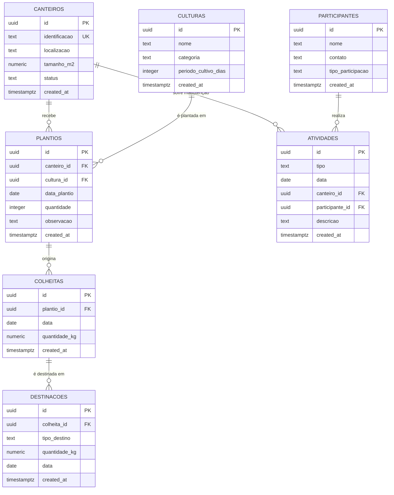

# Diagrama do Banco de Dados (DER)

Espelha exatamente as tabelas criadas em [`/database/schema.sql`](../database/schema.sql).

## Regra de negócio representada no banco

Um trigger (`trg_valida_destinacao`, função `valida_destinacao()`) garante que a
soma das `destinacoes.quantidade_kg` de uma colheita nunca ultrapasse
`colheitas.quantidade_kg` — a regra de negócio central identificada na fase de
Descoberta (ver [`entrega-1.md`](./entrega-1.md)).
