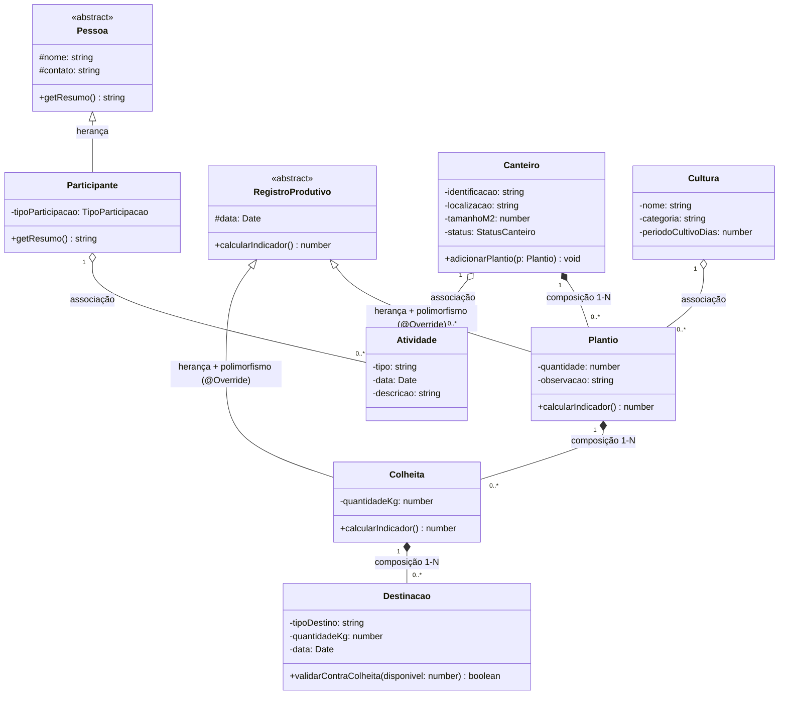

# Diagrama de Classes

Modelo de domínio orientado a objetos do Horta Comunitária — a camada de
classes que vai envelopar o acesso ao banco (`/database/schema.sql`) na
implementação da 2ª entrega. Contém os três elementos exigidos pela AEP:
**herança**, **polimorfismo** e uma **composição de multiplicidade 1:N**.

## Onde está cada requisito

- **Herança**: `Participante` estende a classe abstrata `Pessoa`; `Plantio` e
  `Colheita` estendem `RegistroProdutivo`.
- **Polimorfismo**: `RegistroProdutivo.calcularIndicador()` é sobrescrito
  (`@Override`) de forma diferente em cada subclasse — em `Plantio` retorna a
  quantidade de mudas/sementes, em `Colheita` retorna o total colhido em kg.
  O código que consome um `RegistroProdutivo[]` (por exemplo, no Painel) chama
  o mesmo método sem saber qual subtipo está tratando.
- **Composição 1:N**: um `Canteiro` é dono do ciclo de vida dos seus
  `Plantio`s — ao excluir um canteiro, os plantios são excluídos junto
  (reforçado no banco pelo `ON DELETE CASCADE`, ver
  [`der.md`](./der.md)). O mesmo vale para `Plantio → Colheita` e
  `Colheita → Destinacao`.
